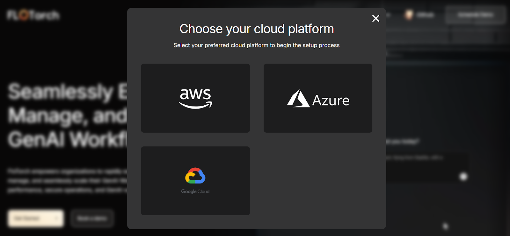
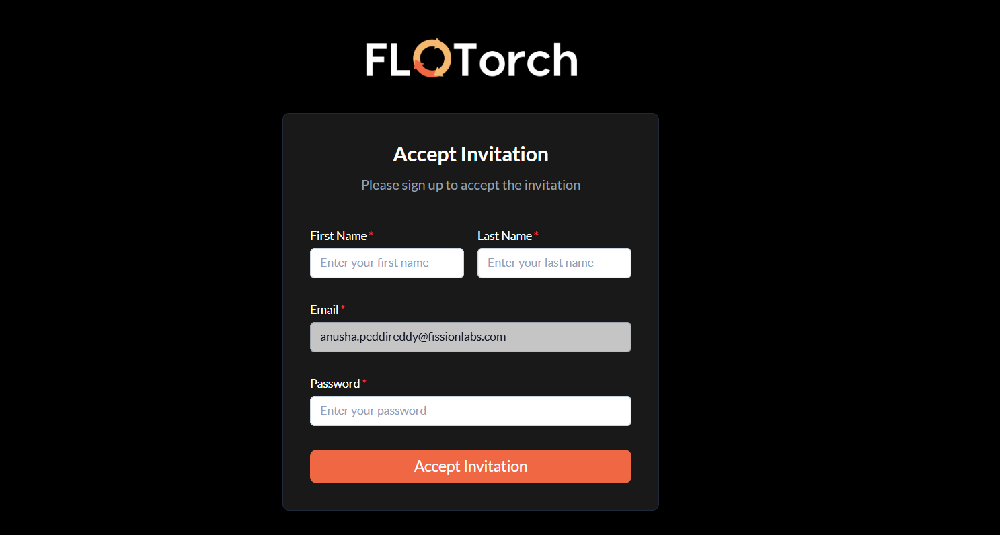

# FloTorch Setup Guide

Get started with FloTorch quickly using this step-by-step guide.

## Sign Up

<!-- markdownlint-disable MD029 -->
1. Go to [FloTorch.ai](https://www.flotorch.ai/) and click **Get Started**.

2. Choose your preferred provider:
   * Amazon Web Services
   * Microsoft Azure
   * Google Cloud

3. Complete the signup form with your:
   * First name
   * Last name
   * Email
   * Password

4. Verify your email by clicking the link in the confirmation message.

5. Log into FloTorch.

6. Create an **organization** (required, and can only be done once). This account becomes the **organization owner**. Each organization can only have one owner and each account can only belong to one organization. Under this organization you can:

   * Create multiple workspaces
   * Invite users with different roles

<!-- markdownlint-enable MD029 -->

### Invited Users

If you were invited to an organization, check your inbox for an invitation email. Use the same email to sign up, then log in to access the FloTorch console.

## Log In

After logging in, what you see depends on your role:

* **Owner / Organization Admins** → Full dashboard with all workspaces, users, and organization metrics.
* **Workspace Admins / Members** → A list of workspaces you’ve been added to. Select one to open its dashboard.

  > **Note:** You must accept your invitation before you can be added to a workspace.

## Get API Keys

1. In the console, go to **Settings** → **API Keys**.
2. Click **New API Key**, add a name and (optional) description, then create the key.
3. API keys grant external access to **resources** (models, agents, workflows, etc.) in the current workspace.

⚠️ **Important:** Copy and store your API key securely — it will not be shown again. You can always refresh or deactivate keys later.

